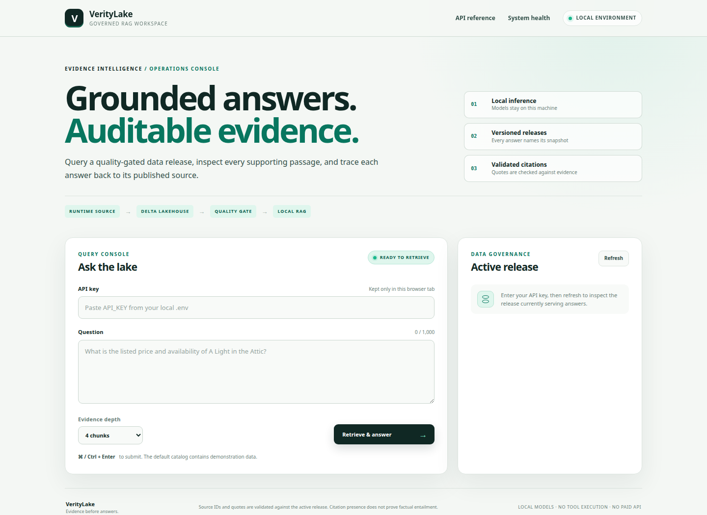
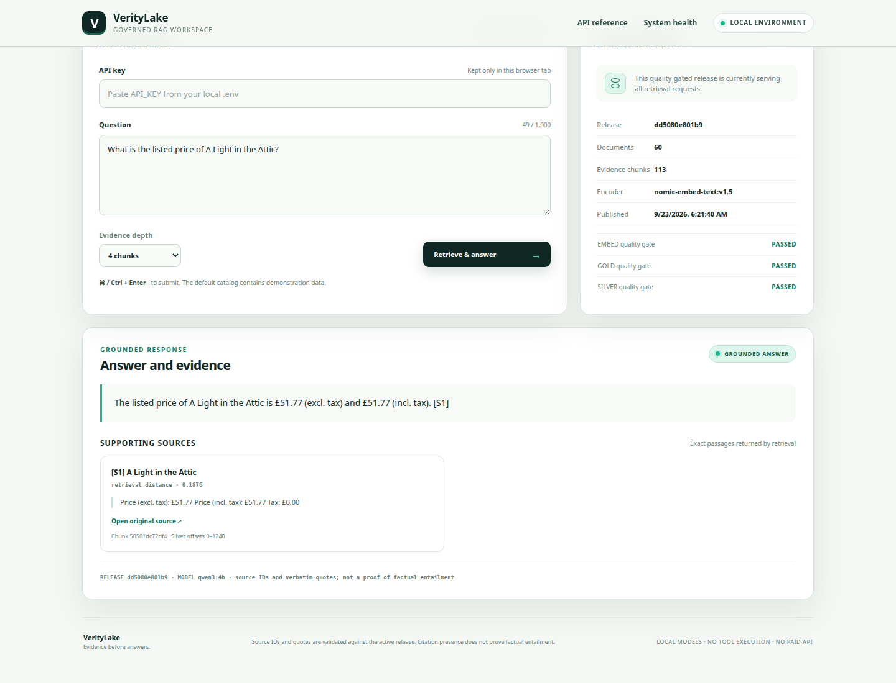
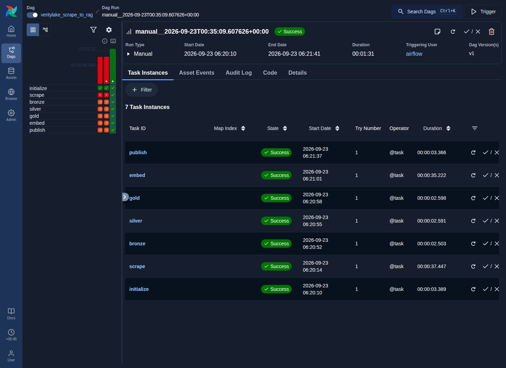
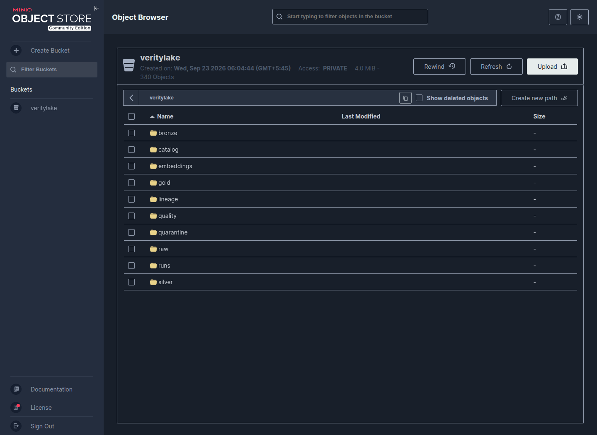
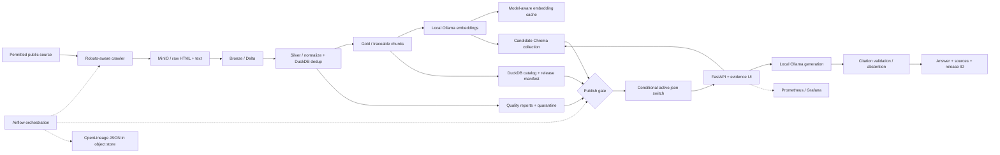

<div align="center">

# VerityLake
### Evidence before answers.
**A governed, local-first data-to-RAG platform with quality-gated publication, traceable sources, and reversible releases.**

Python / Airflow / DuckDB / Delta Lake / S3 / Chroma / Ollama / FastAPI

</div>

---



<p align="center"><sub>The self-contained Evidence UI reports the active service as ready before accepting a query.</sub></p>



<p align="center"><sub>A real retrieval and generation request: the answer cites <code>[S1]</code>, displays the matching verbatim passage, and identifies the active release and model.</sub></p>

<table>
  <tr>
    <td width="50%"></td>
    <td width="50%"></td>
  </tr>
  <tr>
    <td align="center"><strong>Airflow orchestration</strong><br><sub>initialize → scrape → bronze → silver → gold → embed → publish; every task succeeded.</sub></td>
    <td align="center"><strong>Lakehouse storage</strong><br><sub>340 objects across raw data, Delta layers, quality reports, lineage, embeddings and release metadata.</sub></td>
  </tr>
</table>


| Live check | Verified result |
|---|---|
| Service health | `/healthz` returned HTTP 200; API, Airflow, MinIO, Ollama and PostgreSQL reported healthy |
| Published release | `/readyz` returned `ready` for release `dd5080e801b95055a084a0b1696a5845` with 113 vectors |
| Data quality | Silver, Gold and embedding publication gates all passed |
| Grounded answer | Price query returned `answered`, one exact evidence quote and source URL, and inline marker `[S1]` |
| Deterministic tests | 108 passed and 2 service-gated integration modules skipped in 2.68 seconds |

## The problem

A RAG application can answer fluently from a broken pipeline: incomplete crawls, duplicated text, stale documents, mismatched embedding models, or half-built indexes. A green HTTP endpoint does not make its data trustworthy.

VerityLake treats **data publication as a release decision**. Ingestion builds an isolated candidate. Quality checks, vector consistency, model identity, and a queryable catalog must be present before one conditional object-store write makes that candidate visible. A failed pre-publication run leaves the previous release selected. Operators can inspect the evidence and roll back to a retained, validated release.

The default domain is a public **book-catalog scraping sandbox**, not a production retailer. Its prices and inventory are demonstration data. The product question is: *Can an AI application explain which data it used, and can an operator safely change that data?*

## What makes this more than a chatbot

| Engineering concern | Implemented behavior |
|---|---|
| Data integrity | Bronze/Silver/Gold Delta snapshots, deterministic DuckDB deduplication, schema and quality reports, quarantine |
| Safe change | Run-scoped tables and vector collections; compare-and-swap active pointer; retained release manifests; explicit rollback |
| Traceability | Raw HTML bytes, extracted text, URLs, timestamps, content hashes, chunk offsets, model digest, Git SHA, OpenLineage events |
| Retrieval integrity | Local embeddings, model-aware cache, vector count/dimension checks, self-retrieval probe |
| Answer safeguards | Local generation, bounded retrieval, exact-quote/source-ID validation, abstention, no model tools |
| Operations | Health/readiness separation, JSON logs, Prometheus metrics, Grafana dashboard, resource caps, cold backup/restore |
| Delivery | PR tests, service-contract CI, secret/dependency/container scans, SBOM/provenance, signed images, approved digest deployment |
| Honest evaluation | Retrieval fixtures, adversarial review cases, CLI and actual Airflow benchmark scripts; no invented performance numbers |

**Validation:** 108 deterministic tests pass. The containerized Airflow DAG and end-to-end smoke test exercise the Docker, MinIO, Chroma, Ollama and FastAPI path. Two service-gated integration modules remain separate from the default test suite.

## Architecture



Airflow runs `initialize -> scrape -> bronze -> silver -> gold -> embed -> publish`. XComs contain a run ID, not HTML, vectors, or secrets. LocalExecutor and DuckDB avoid a Redis/Spark cluster for a 60-page workload. Delta remains the storage contract; the catalog is a real DuckDB database rather than only a JSON label.

## Quick start

Use a machine with Docker Engine and Docker Compose v2, Python 3, an internet connection for initial builds/model downloads and runtime scraping, and free local ports shown below. For capacity planning, start with **4 CPU cores, 16 GB RAM, and at least 20 GB of free disk**; these are planning recommendations, not measured minimum requirements. The default stack has several Airflow processes plus a CPU LLM. An 8 GB laptop may run out of memory.

From the extracted project directory:

```bash
python3 scripts/bootstrap.py
docker compose up --build -d
docker compose ps
```

Bootstrap creates a private `.env` with random, separate credentials and will not overwrite it. The Compose startup graph initializes the bucket and access policies, downloads the two local models, migrates Airflow, starts the scheduler, and schedules the unpaused `@once` DAG. **First startup includes a source build of MinIO and model downloads; it is not a five-minute benchmark.**

```bash
# Follow progress. A missing initial release is normal until publish succeeds.
docker compose logs --tail=100 -f model-init airflow-scheduler api

# When the DAG has published a release:
curl --fail http://127.0.0.1:8000/readyz
python3 scripts/ask.py "What is the listed price of A Light in the Attic?"
python3 scripts/smoke.py
```

| Interface | Address | Credentials |
|---|---|---|
| Evidence UI and RAG API | `http://localhost:8000` | Paste `API_KEY` from your local `.env` into the UI |
| API schema | `http://localhost:8000/docs` | Requests to protected routes still need `X-API-Key` |
| Airflow | `http://localhost:8080` | `admin` / `AIRFLOW_ADMIN_PASSWORD` |
| MinIO console | `http://localhost:9001` | `MINIO_ROOT_USER` / `MINIO_ROOT_PASSWORD` |
| MinIO S3 endpoint | `http://localhost:9000` | Separate writer/reader accounts generated locally |
| Grafana, optional | `http://localhost:3000` | `admin` / `GRAFANA_ADMIN_PASSWORD` |
| Prometheus, optional | `http://localhost:9090` | Localhost only |

The UI stores the key only in page memory. Do not share `.env`, paste real keys into screenshots, or expose these development ports publicly. Swagger's default documentation assets can need internet; the custom evidence UI is self-contained.

```bash
# Optional operational dashboards
make observe

# Trigger the real Airflow DAG again; the default schedule is @once, not hourly.
make trigger

# Graceful stop; named volumes remain.
docker compose down
```


```text
                 DATA ENGINEERING
                       │
                       ▼
 Public Website
       │
 BeautifulSoup + HTTPX
       │
       ▼
 ┌───────────────────────────────┐
 │          MinIO / S3           │
 │                               │
 │ RAW → BRONZE → SILVER → GOLD │
 └──────────────┬────────────────┘
                │
         Delta Lake
                │
        DuckDB transforms
                │
                ▼
          Gold Chunks
                │
                │
        AI / LLMOps STACK
                ▼
       Ollama Embeddings
       nomic-embed-text:v1.5
                │
                ▼
            ChromaDB
                │
         Vector Search
                │
                ▼
          FastAPI RAG
                │
          Qwen3 4B
                │
                ▼
       Answer + Sources


        ORCHESTRATION
              │
        Apache Airflow
              │
              ▼
 scrape → bronze → silver
       → gold → embed
       → quality → publish


       GOVERNANCE / DATAOPS
              │
      OpenLineage
      Data Quality
      Quarantine
      Metadata Catalog
      Dataset Versions
      Rollback


         OBSERVABILITY
              │
      Prometheus → Grafana


            DEVOPS
              │
       GitHub Actions
              │
     Test → Scan → Build
              │
             Docker
              │
        Docker Compose
              │
           Terraform
              │
             AWS
```


| Layer               | Technology                                      | Role                                  |
| ------------------- | ----------------------------------------------- | ------------------------------------- |
| **Language**        | **Python**                                      | Main application and pipeline         |
| **Scraping**        | **BeautifulSoup + HTTPX**                       | Crawl and extract public web data     |
| **Object Storage**  | **MinIO / S3-compatible storage**               | Data lake                             |
| **Lakehouse**       | **Delta Lake / delta-rs**                       | Bronze → Silver → Gold tables         |
| **Analytics / ETL** | **DuckDB + SQL**                                | Cleaning and transformations          |
| **Catalog**         | **DuckDB**                                      | Dataset/schema/version metadata       |
| **Orchestration**   | **Apache Airflow**                              | Runs the complete data pipeline       |
| **Embeddings**      | **Ollama + nomic-embed-text:v1.5**                     | Local text embeddings                 |
| **Vector DB**       | **ChromaDB**                                    | Persistent vector search              |
| **LLM**             | **Qwen3 4B through Ollama**                   | Generates RAG answers                 |
| **Backend/API**     | **FastAPI**                                     | `/ask`, health and metrics APIs       |
| **Frontend**        | HTML + CSS + JavaScript                         | RAG demonstration UI                  |
| **Lineage**         | **OpenLineage**                                 | Pipeline lineage/events               |
| **Metrics**         | **Prometheus**                                  | Service/pipeline metrics              |
| **Dashboard**       | **Grafana**                                     | Monitoring visualization              |
| **Containers**      | **Docker + Docker Compose**                     | Local platform deployment             |
| **CI/CD**           | **GitHub Actions**                              | Test/build/security/release workflows |
| **IaC**             | **Terraform**                                   | Optional AWS infrastructure           |
| **Cloud target**    | **AWS S3 + IAM + OIDC**                         | Cloud migration/deployment path       |
| **Testing**         | **Pytest**                                      | Unit/integration/contract testing     |
| **Security**        | Secret scanning + vulnerability scanning + SBOM | DevSecOps                             |
| **Configuration**   | `.env` / environment variables                  | Secrets/configuration separation      |

**Do not use `docker compose down --volumes` unless deliberately deleting local data and model caches.** Named volumes preserve the database, object store, vector index and downloaded models across normal restarts.

## API contract

`GET /ask?question=...&top_k=4` and `POST /ask` both return `answer` and `sources`, plus status, release ID, and model names. Prefer POST: GET questions can appear in browser history or upstream proxy logs.

```bash
# Replace the placeholder with your locally generated key. Do not commit this command with a real key.
curl --fail-with-body http://localhost:8000/ask \
  -H 'X-API-Key: REPLACE_WITH_YOUR_LOCAL_API_KEY' \
  -H 'Content-Type: application/json' \
  -d '{"question":"What is the listed price of A Light in the Attic?","top_k":4}'
```

The following is a **response-shape illustration, not captured live model output**:

```json
{
  "answer": "The supported answer contains an inline source reference [S1].",
  "sources": [{
    "source_id": "S1",
    "url": "https://source.example/document",
    "title": "Source title",
    "chunk_id": "content-derived-chunk-id",
    "doc_id": "content-derived-document-id",
    "quote": "Exact text from the retrieved evidence",
    "char_start": 0,
    "char_end": 220,
    "fetched_at": "2026-09-18T00:00:00+00:00",
    "distance": 0.12
  }],
  "status": "answered",
  "reason": null,
  "run_id": "32-character-run-identifier",
  "embedding_model": "nomic-embed-text:v1.5",
  "generation_model": "qwen3:4b"
}
```

`status=abstained` with empty sources is an intentional outcome when retrieval, model confidence, or citation validation is insufficient. `503` means a dependency or dataset is not usable; `429` means the local request budget is exhausted. A valid quote establishes provenance, **not that every claim logically follows from the quote**. There is no automatic factual-correctness guarantee.

Other endpoints: `/catalog` (authenticated active release metadata), `/healthz` (process liveness), `/readyz` (dataset/model/index checks), `/metrics` (local monitoring). `top_k` is 1-10; questions are limited to 1,000 characters; one API process enforces a shared local concurrency/rate budget.

## Lake layout and data contracts

```text
veritylake/
  raw/<run>/pages/<doc>.html | .txt | .json
  raw/<run>/documents.json | robots.json | errors.json
  bronze/<run>/documents/      # Delta log + Parquet
  silver/<run>/documents/      # Delta log + Parquet
  gold/<run>/chunks/           # Delta log + Parquet
  embeddings/cache/           # Model/content-aware cache keys
  quality/<run>/              # Silver / Gold / embedding reports
  quarantine/<run>/silver.json
  lineage/<run>/<stage>/       # OpenLineage START / COMPLETE / FAIL
  runs/<run>/                 # Frozen configuration and stage results
  catalog/runs/<run>/catalog.duckdb
  catalog/releases/<run>.json
  catalog/publication_intents/
  catalog/active.json          # Single conditional visibility point
```

Raw source data is **not** bundled in this repository. The runtime fetch creates it. `char_start` and `char_end` address normalized Silver text, not original HTML byte positions. A release points at exact Delta versions and a run-specific Chroma collection.

```bash
make catalog
make history
docker compose run --rm tools verify-release
docker compose run --rm tools download-catalog --output /work/reports/catalog.duckdb
# With DuckDB installed on the host:
python3 -c "import duckdb; c=duckdb.connect('reports/catalog.duckdb', read_only=True); print(c.sql('SELECT * FROM datasets'))"
```

## Configuration and models

`.env.example` documents the default local configuration. Default ingestion selects 60 product documents, needs at least 50 accepted unique documents, and waits at least 0.5 seconds between requests unless robots rules require a longer delay. It rejects private crawl targets, cross-origin redirects, oversized responses, and unbounded retries.

Embeddings use **Ollama `nomic-embed-text:v1.5`**. Generation uses **Ollama `qwen3:4b`**, with thinking disabled for this bounded question-answering path. Models run locally after download; no paid inference service or external embedding API is used. The embedding tag, resolved digest, and prefix version are frozen in each release. Changing models requires re-embedding and a new release. Generation model tags are not content-pinned by the application; record their digest during a deployment review.

For another permitted HTML site, edit `SOURCE_URL`, use `SOURCE_ADAPTER=generic`, set `SOURCE_SELECTOR`, `SOURCE_PATH_PREFIX`, and a narrow `SOURCE_RECORD_PATTERN`, then restart the application/Airflow services and trigger a new run. A new source requires reviewing its terms, robots rules, extraction behavior, quality thresholds, and evaluation fixtures. Generic support is not a claim that arbitrary sites work unmodified. JS-only pages are intentionally out of scope; Playwright is future work.

`LOG_FORMAT=pretty` provides readable local logs; the default is structured JSON. Logs go to stderr so CLI stdout stays machine-readable. Configure optional `OPENLINEAGE_URL` with a compatible receiver base URL (the client appends `/api/v1/lineage`) to forward events; durable object-store events remain authoritative.

Optional GPU configuration, requiring a functioning NVIDIA container runtime:

```bash
docker compose -f compose.yaml -f compose.gpu.yaml up --build -d
```

GPU support has not been exercised in the supplied validation run. The default is CPU-only.

## Development and verification

Use Python 3.12 or 3.13 in a virtual environment:

```bash
python3 -m venv .venv
source .venv/bin/activate
python -m pip install -r requirements-dev.txt -e .
make check
python scripts/check_static.py
make dag-test                 # Requires the built Airflow image and initialized database
```

The default tests are deterministic and network-free. Native integration modules require their actual dependencies; live MinIO/Chroma service tests require `RUN_SERVICE_TESTS=1` and the CI overlay. A passing test with a mock is not presented as a real Ollama, Airflow, or object-store result.

```bash
make evaluate                # Small, human-authored URL retrieval smoke set
make benchmark               # Warm CLI pipeline only
make benchmark-airflow       # Actual Airflow DAG, including trigger/queue/poll overhead
```

The requested **50-100 pages in at most five minutes on four cores is a target, not a measured achievement**. `MAX_PAGES=60` is the default. Model/image downloads and cold bootstrap are excluded from warm timing, but website rate limits are never bypassed. The benchmark records machine information and explicitly separates CLI duration from Airflow duration. A cached second run does not establish uncached embedding throughput. The four retrieval cases are a focused smoke set rather than a representative quality benchmark.

For stage-by-stage debugging, create one run with `docker compose run --rm tools new-run`, copy its run ID, and use `make scrape RUN_ID=...`, `make etl RUN_ID=...`, `make embed RUN_ID=...`, and `make publish RUN_ID=...`. Do not overlap manual runs with Airflow: the active-pointer conflict check will refuse stale publishers rather than silently overwrite a release.

## DevOps, operations and optional infrastructure

GitHub Actions provides separate paths for deterministic tests, actual storage/DAG contracts, security checks, signed image publication, approved API deployment, and an opt-in expensive live acceptance run. No workflow pretends it has already run on your GitHub account. Configure branch protection and deployment environments after publishing the repository; these are account settings, not guaranteed by committing YAML.

The release workflow builds app, Airflow and patched-source MinIO/tool images; attaches SBOM/build provenance; checks fixable HIGH/CRITICAL findings; and signs the digest after the scan. The deployment workflow verifies the signing identity and deploys **only the API** to an already-provisioned Docker host, with readiness-gated rollback. This is not a zero-downtime, stateful-platform upgrade mechanism.

Optional Terraform configuration provisions an AWS S3 storage foundation, DynamoDB Delta coordination, and scoped IAM policies. It does not deploy the full stack, promise free-tier operation, or create access keys. Cloud costs and deployment are deliberately opt-in.

**MinIO maintenance warning:** the community repository is archived. This local demonstration builds the October 15, 2025 security-fix source release instead of silently selecting an older pre-fix image. That does not make an archived dependency a maintained production choice. Evaluate a maintained S3 service before production. Airflow's SimpleAuth/Compose configuration is likewise a development arrangement, not an internet-facing production control plane.

## Repository map

```text
src/veritylake/       Pipeline, storage, quality, RAG, API, SQL and self-contained UI
dags/                Airflow TaskFlow DAG
tests/               Unit, mocked SDK contracts, native and live-service integration tests
eval/                Retrieval fixtures and adversarial human-review cases
scripts/             Bootstrap, model/storage/Airflow init, live smoke, benchmarks, backup and deployment
docker/              Application, Airflow and patched-source storage Dockerfiles
ops/                 Prometheus, Grafana dashboard/provisioning and k6 load script
infra/terraform/     Optional AWS object-store foundation
.github/workflows/   CI, releases, approved API deployment and manual live acceptance
docs/                Architecture, decisions, security, operations, evaluation and portfolio demo
reports/             Actual packaging-time test evidence and explicit validation limitations
```

## Deliberate limits and future work

This is a serious **single-host engineering portfolio**, not an HA multi-tenant product. Before production: replace local authentication with an identity-aware gateway, enforce network-level egress and tenant isolation, use a maintained storage service, harden dependency/action pinning, validate backups and upgrades on real infrastructure, run representative answer-quality evaluations, and measure operational SLOs. Add reference-aware garbage collection rather than deleting old Delta/vector releases independently. Broader source adapters, streaming, hybrid retrieval/reranking and horizontally scalable serving follow evidence of need, not a checklist of fashionable tools.

The project is suitable for demonstrating AI-platform, data-platform, DataOps/MLOps and DevOps engineering judgment. Its strongest hiring signal is a reproducible demonstration of failures, recovery and evidence-aware release controls.

## License

Original repository code: [MIT](LICENSE). Dependencies, upstream storage source, downloaded models and crawled content retain their own licenses and terms. No scraped corpus, model weights, private credentials, or fabricated live results are distributed here.
