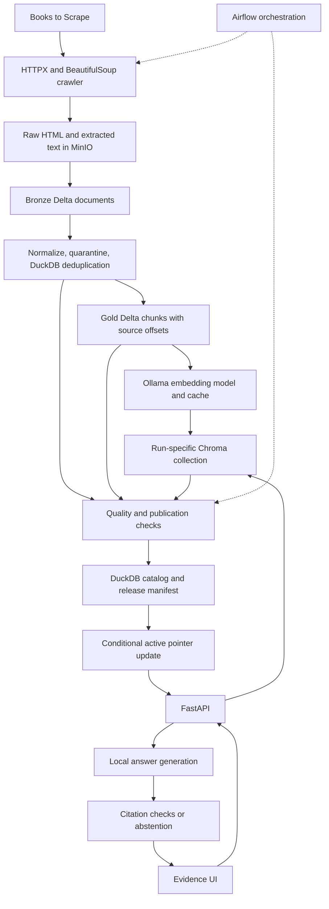

# VerityLake: end-to-end codebase guide

This guide describes the implementation in this repository, inspected on 2026-09-21. Commands run from the `veritylake` directory. Runtime results belong in `reports/runtime/`; the supplied packaging reports are historical evidence, not proof that this installation works.

## 1. What it is and why it exists

VerityLake is a local data platform that turns permitted website content into a versioned, searchable dataset and answers questions with cited evidence. Its example source is Books to Scrape, a public demonstration book catalog. Book prices and stock are example data.

The problem is that a chatbot can sound convincing even when its source pipeline is incomplete, stale, duplicated, or using incompatible embeddings. VerityLake makes publication an explicit decision: build a candidate, test its data and index, record its provenance, and only then make it visible to users.

For example, a user asks, “What is the listed price of A Light in the Attic?” The system retrieves book text from the selected release, asks a local language model to answer using that text, checks its quoted evidence, and returns the answer with source links and the release ID. If a later crawl fails, the earlier release stays selected. Its normal freshness checks still apply; retaining a release does not make old data fresh.

Useful applications of this design include controlled knowledge collections, internal documentation search, and auditable AI demonstrations. Those domains would need their own ingestion adapters, permissions, evaluations, and operating controls. The current implementation is a single-host portfolio platform, not a finished multi-tenant enterprise service.

## 2. Concepts in plain language

| Concept | Meaning here |
|---|---|
| RAG | Retrieve relevant stored text before asking a language model to generate an answer. |
| Data lake | Files and metadata stored in the MinIO bucket, using an S3-compatible API. |
| Lakehouse | Structured Delta tables in that lake, including schemas and versioned transaction logs. |
| Bronze / Silver / Gold | Extracted documents / cleaned documents / searchable text chunks. |
| Embedding | A numeric representation of text used to compare semantic similarity. |
| Vector index | Chroma collections containing embeddings, text, and source metadata. |
| Release | A manifest tying table versions, model identity, quality evidence, and one vector collection together. |
| Active pointer | `catalog/active.json`, the small object selecting the visible release. |
| Compare-and-swap | Update the pointer only if its stored version still matches the expected version. |
| Lineage | Records showing which stage consumed and produced which datasets. |
| Abstention | An explicit refusal to answer because adequate validated evidence is unavailable. |

## 3. System architecture



Airflow controls ingestion. FastAPI serves questions. Both use the same Python package, but serving reads the published catalog and vector collection instead of executing the ingestion pipeline for every question. PostgreSQL stores Airflow metadata; it does not store the book corpus.

## 4. Why each technology is present

| Technology | Actual responsibility and reason |
|---|---|
| Python | Shared pipeline, adapters, validation, API, and command-line implementation. |
| HTTPX | Bounded HTTP access for crawling, model inference, and optional lineage delivery. |
| BeautifulSoup | Extract book fields and links from HTML without a browser engine. |
| MinIO / S3 | Persist raw evidence, tables, reports, manifests, and cache independently of application containers. |
| PyArrow | Explicit typed schemas and conversion between Python rows and columnar tables. |
| Delta Lake | Store Parquet-backed snapshots with exact versions that releases can reference. |
| DuckDB | Deduplicate a small batch using SQL and build a queryable metadata catalog. |
| Airflow LocalExecutor | Stage dependencies, retries, history, and operational visibility on one machine. |
| Ollama | Run the embedding and generation models locally after downloading them. |
| Chroma | Search precomputed embeddings using cosine distance. |
| FastAPI / Pydantic | Validate requests and responses and expose the serving interface. |
| Plain HTML, CSS, JavaScript | Provide a self-contained evidence UI without a frontend build system. |
| Prometheus / Grafana | Optional operational metrics and dashboards. |
| Docker Compose | Wire dependencies, persistent volumes, local ports, and credentials. |
| Terraform | Optional AWS storage and IAM foundation; it does not deploy the application platform. |

The implementation uses small batch processing rather than a distributed processing cluster. It loads document/chunk rows into Python memory; its configured scale is at most 100 selected documents per crawl.

## 5. Website-to-release workflow

### Initialize

`Pipeline.new_run()` creates a UUID-based run ID, stores selected nonsecret pipeline settings and their fingerprint, and captures the current active object's ETag. Airflow derives a stable pipeline ID from its DAG run ID so retries share a candidate. Selected configuration drift prevents resuming the same run. Not every operational setting is included in the fingerprint.

### Scrape

`Crawler` reads robots rules, traverses same-origin links with a bounded queue, and selects product URLs matching the configured regular expression. It checks public destination addresses, rejects query-string URLs and unsafe paths, checks redirects, limits response size, and uses bounded retries. Rate limits and robots delays affect request pacing. DNS checks are defense in depth, not a replacement for a network egress policy.

The books adapter extracts title, rating, product-table fields such as price and availability, and description. Listing pages help discover products but are not selected documents. The generic adapter extracts a configured region after removing common active and navigation elements; it does not execute JavaScript.

The pipeline preserves response-body HTML bytes, extracted text, page metadata, robots information, errors, and selected-document rows. It fails if too few documents were collected.

### Bronze

`DeltaTables.write()` writes extracted rows with an explicit document schema. This layer preserves the initial structured extraction and links back to raw HTML. Bronze is a Delta table, not simply the raw HTML directory.

### Silver

The code normalizes Unicode and whitespace, strips most control characters, and redacts email patterns by default. It rejects missing titles, short content, invalid/stale/future timestamps, and selected instruction-like patterns. Rejections are recorded in quarantine.

DuckDB executes `sql/silver.sql`: partition by normalized content hash, select the deterministic winner ordered by URL and document ID, and order the output by document ID. Quality checks require enough documents, unique document IDs and content, an acceptable rejection fraction, and nonempty output. Reports are persisted before enforcement.

### Gold

Documents become overlapping word windows: 220 words with 35-word overlap by default. Each chunk has a stable content-dependent ID, document ID, ordinal, URL, title, timestamp, raw key, and character offsets. Offsets index normalized Silver text, not HTML bytes. Tests check that slicing Silver text at those offsets exactly reproduces the chunk.

Gold validation checks chunk limits, uniqueness, document coverage, offsets, and text size. Chunking makes retrieval more focused and bounds the context sent to the model.

### Embed and index

`OllamaEmbedder` resolves the embedding model's tag and digest. It adds `search_document:` when indexing and `search_query:` when embedding questions. These semantics are written for the default Nomic encoder; changing the model may require adapter changes, not just changing an environment variable.

The embedding cache key includes model identity, prefix version, and text hash. Unchanged text under the same model can reuse vectors across runs. Validation rejects wrong counts, inconsistent dimensions, nonfinite values, and all-zero vectors.

Chunks and vectors are upserted into `vl_<run_id>` in Chroma. The pipeline checks vector count and self-retrieval for up to five chunks. Self-retrieval verifies index integrity; it does not measure whether real questions will receive correct answers.

### Publish

The pipeline creates a DuckDB metadata file and a release manifest containing exact table versions, quality reports, embedding identity, collection, counts, source, configuration fingerprint, and Git SHA. It rechecks model identity and collection count.

`Publications.publish()` validates required release evidence, prevents changing an existing manifest, records a publication intent, and conditionally updates the active pointer. A concurrent writer with an outdated ETag receives a conflict. The candidate's existence alone does not make it visible.

This is a controlled visibility protocol across multiple stores, not a distributed transaction covering every object and vector. Runtime checks cover selected invariants; they do not cryptographically verify every referenced artifact. Administrative mutation or deletion can still break a previously published release.

### Retry and rollback

Completed stages return their stored results on retry. Failed stages can retry under the same configuration. An already committed active-pointer update can be acknowledged idempotently if a task failed before recording completion.

Rollback selects a retained validated release after checking its vector count and embedding model identity. It does not recreate deleted files, restore missing vectors, change models, or bypass dataset freshness checks.

## 6. Question-to-answer workflow

1. The UI sends `POST /ask` with the API key, question, and `top_k`.
2. FastAPI validates length and bounds, authenticates the key, and acquires the process-local request budget.
3. `RAGService.checked_release()` resolves the active release, checks encoder identity, and rejects a dataset older than the configured age using the run's creation timestamp.
4. Ollama embeds the question and Chroma searches that release's collection.
5. Results beyond cosine distance 0.65 are discarded by default. Evidence is capped at 3,500 characters per result and 15,000 characters overall.
6. The generator receives the question and evidence labeled `S1`, `S2`, etc., with a structured JSON answer schema and instructions to use evidence only. Default temperature is zero; thinking is disabled; output is bounded.
7. Validation requires inline source IDs to match cited IDs and each quote to be an exact substring of retrieved evidence.
8. The response contains an answer, source metadata, release ID, model names, and `answered` or `abstained` status. The request slot is released even on failure.

No relevant evidence, model abstention, and invalid citations produce distinct abstention reasons. Dependency errors produce HTTP 503. Exact quotes prove provenance, not that all generated claims logically follow from them. Pattern quarantine and prompting do not guarantee complete prompt-injection protection.

## 7. API and UI

| Route | Purpose | Authentication |
|---|---|---|
| `/` | Evidence UI | Page itself is public locally |
| `/static/*` | Bundled UI assets | No API key |
| `/docs` | Interactive API schema | Protected operations still need a key |
| `/healthz` | Process liveness | No API key |
| `/readyz` | Release freshness, model identity, vector count, generation-model availability | No API key |
| `/catalog` | Active release metadata and quality checks | `X-API-Key` |
| `GET /ask` | Question via query parameters | `X-API-Key` |
| `POST /ask` | Question in JSON body; preferred for avoiding question-bearing URLs | `X-API-Key` |
| `/metrics` | Prometheus exposition | No API key; localhost boundary |

Questions must be nonblank and at most 1,000 characters. `top_k` is 1–10. Defaults permit 30 accepted answer requests per minute and two concurrent requests for the single API process. HTTP 401 indicates authentication failure, 422 invalid input, 429 exhausted capacity, and 503 an unusable dependency or release.

The UI reads the key from its input field, keeps it in page memory, and displays answers and quotes using `textContent`. Source links are restricted to HTTP(S). Readiness is checked on page load and after catalog refresh; this is not a continuous background readiness monitor.

## 8. Complete application module map

Paths below are relative to `src/veritylake/`.

| File | Responsibility |
|---|---|
| `__init__.py` | Package identity/version. |
| `config.py` | Environment settings, validation, selected public configuration and fingerprint. |
| `crawler.py` | URL policy, robots, rate pacing, retries, traversal, and extraction coordination. |
| `text.py` | HTML adapters, normalization, instruction patterns, and exact-offset chunking. |
| `quality.py` | Document preparation, quarantine reasons, Silver/Gold reports, and gate enforcement. |
| `storage.py` | Object-store abstraction, POSIX local adapter, S3 adapter, conditional writes, Delta options. |
| `tables.py` | Document/chunk schemas, Delta read/write, DuckDB deduplication and catalog construction. |
| `sql/silver.sql` | Deterministic content deduplication. |
| `pipeline.py` | Stage execution, results, provenance, candidate creation, publication, and rollback checks. |
| `publication.py` | Release validation, immutable-manifest convention, pointer selection, history, and switching. |
| `embeddings.py` | Ollama embedding API, model identity, validation, and cache. |
| `vectors.py` | Local/HTTP Chroma adapter, cosine collections, upserts, counts, and queries. |
| `rag.py` | Generation schema, prompt, release checks, retrieval, citations, and abstention. |
| `api.py` | FastAPI routes, authentication, request budgets, metrics, headers, and static serving. |
| `cli.py` | CLI commands for ingestion, stages, catalog, history, verification, rollback, and evaluation. |
| `evaluation.py` | Expected-URL retrieval recall and reciprocal-rank evaluation. |
| `lineage.py` | Durable OpenLineage START/COMPLETE/FAIL events and optional best-effort forwarding. |
| `logging.py` | JSON or readable logging; structured operational fields. |
| `util.py` | UTC timestamps, SHA-256, deterministic JSON encoding, strict run-ID validation. |
| `ui/index.html` | Key, question, retrieval controls, answer, and catalog page structure. |
| `ui/app.js` | API requests and safe rendering of evidence and release details. |
| `ui/style.css` | UI appearance and layout. |

## 9. Persistent data and identities

```text
raw/<run>/pages/                 HTML, extracted text, page metadata
raw/<run>/documents.json         Selected extracted document rows
raw/<run>/robots.json            Captured crawl policy
raw/<run>/errors.json            Crawl diagnostics
bronze/<run>/documents/          Initial Delta snapshot
silver/<run>/documents/          Cleaned Delta snapshot
gold/<run>/chunks/               Chunk Delta snapshot
quarantine/<run>/silver.json     Rejection identities and reasons
quality/<run>/                   Silver, Gold, embedding checks
embeddings/cache/                Model-aware vector cache
runs/<run>/run.json              Frozen selected configuration and base ETag
runs/<run>/stages/               Status, timing, outputs or failure type
lineage/<run>/<stage>/           Events grouped by stage attempt
catalog/runs/<run>/catalog.duckdb Metadata SQL database
catalog/releases/<run>.json      Retained release manifests
catalog/publication_intents/     Intended publish/rollback operations
catalog/active.json              Current selected release
reports/<run>/benchmark.json     Pipeline timing
```

Document IDs hash canonical URLs. Raw content hashes describe response bytes; Silver content hashes describe normalized text. Chunk IDs incorporate document/content identity and chunking settings. Chroma holds chunk text as well as embeddings, which is why serving can retrieve evidence without reading Delta tables.

The catalog contains `datasets`, `columns`, and `checks` tables. It is a metadata database, not a copy of the complete document corpus. Named Docker volumes retain MinIO, Chroma, Ollama models, PostgreSQL, and Airflow configuration/logs across ordinary shutdowns.

## 10. Docker services and startup order

| Service | Role |
|---|---|
| `postgres` | Airflow metadata database. |
| `minio` | Lake object storage; locally built source image. |
| `minio-init` | Create versioned bucket and separate writer/catalog-reader accounts. |
| `chroma` | Internal vector database with persistent data. |
| `ollama` | Internal local model server; CPU by default. |
| `model-init` | Wait for model/vector services, pull both models, warm the encoder. |
| `airflow-init` | Write local admin credentials and migrate Airflow metadata. |
| `airflow-api` | Airflow UI/API and execution API. |
| `airflow-dag-processor` | Discover and parse the DAG. |
| `airflow-scheduler` | Schedule tasks with LocalExecutor after dependencies initialize. |
| `api` | Evidence UI and RAG service using catalog-only S3 credentials. |
| `tools` | On-demand CLI container under the `tools` profile. |
| `prometheus`, `grafana` | Optional `observability` profile. |

The app Dockerfile builds a Python 3.12 image, installs pinned direct dependencies, packages assets, and runs as a nonroot user. The Airflow image installs the same package and copies the DAG. The storage Dockerfile compiles MinIO and its client from specified source tags and includes source/license artifacts.

The DAG is `veritylake_scrape_to_rag`: `initialize → scrape → bronze → silver → gold → embed → publish`. It is unpaused with an `@once` schedule, one active run and task, two task retries, 30-second retry delay, 12-minute task timeout, and 20-minute DAG timeout. It will not automatically refresh every 72 hours; schedule changes or explicit triggers are needed.

## 11. Actual defaults

| Setting | Default |
|---|---|
| Selected products / minimum accepted | 60 / 50 |
| Maximum visited URLs | 180 |
| Minimum request interval | 0.5 seconds, increased by robots rules |
| Minimum document text | 100 characters |
| Maximum rejected fraction | 0.2 |
| Dataset age limit | 72 hours |
| Chunk words / overlap | 220 / 35 |
| Maximum chunks | 1,500 |
| Embedding model | `nomic-embed-text:v1.5` |
| Generation model | `qwen3:4b` |
| Embedding batch | 16 |
| Model request timeout | 180 seconds |
| Maximum retrieval distance | 0.65 |

The README previously included a second illustration naming smaller models; the settings and Compose defaults above determine actual behavior. The generation model tag is not pinned by application digest checks. `.env` configures Compose interpolation, but Compose passes an explicit subset to containers: adding an arbitrary Settings field to `.env` does not automatically forward it into every service.

## 12. Run locally

From a terminal:

```bash
cd /home/punam/Music/IMPFolder/Project/VerityLake_Senior_Portfolio/veritylake
python3 scripts/bootstrap.py
docker compose config --quiet
docker compose up --build -d
docker compose ps -a
docker compose logs --tail=100 model-init airflow-scheduler api
```

Bootstrap creates `.env` with unique secrets and mode 0600, and does not overwrite an existing file. Initial startup needs internet access for images, source compilation dependencies, Python dependencies, models, and the website. Generation and embeddings run locally after model installation. The full platform is not offline while scraping.

The repository suggests four CPU cores, 16 GB RAM, and 20 GB free disk as planning guidance. The inspected host has approximately 62 GiB total RAM and 329 GiB available workspace filesystem space. These are host observations, not measured application requirements.

Wait for actual publication, then verify:

```bash
curl --fail http://127.0.0.1:8000/readyz
python3 scripts/ask.py "What is the listed price of A Light in the Attic?"
python3 scripts/smoke.py
docker compose run --rm tools verify-release
```

| Interface | Address | Local credential |
|---|---|---|
| Evidence UI | http://localhost:8000 | `API_KEY` from `.env` |
| API docs | http://localhost:8000/docs | API key for protected requests |
| Airflow | http://localhost:8080 | `admin` / `AIRFLOW_ADMIN_PASSWORD` |
| MinIO console | http://localhost:9001 | `MINIO_ROOT_USER` / `MINIO_ROOT_PASSWORD` |
| Grafana, after `make observe` | http://localhost:3000 | `admin` / `GRAFANA_ADMIN_PASSWORD` |
| Prometheus, after `make observe` | http://localhost:9090 | Local interface |

Read credentials locally in the editor. Chroma and Ollama have no published host ports. A healthy API process can still have a 503 readiness response until a valid release exists.

Common operations:

```bash
make trigger                      # Another real Airflow run
make catalog                      # Inspect selected release
make history                      # Inspect retained manifests
make evaluate                     # Small retrieval fixture set
make benchmark-airflow            # Trigger and time an actual DAG run
make observe                      # Start metrics and dashboards
docker compose down               # Stop/remove containers; keep volumes
```

For manual stage debugging, use `tools new-run` and pass the returned run ID to `make scrape`, `make etl`, `make embed`, and `make publish`. Run manual publication separately from active Airflow ingestion to avoid stale-writer conflicts. `make rollback RUN_ID=<retained-id>` switches to a retained candidate that passes rollback checks. Do not use `down --volumes` to perform an ordinary stop.

## 13. Scripts and supporting files

| File/group | Purpose |
|---|---|
| `scripts/bootstrap.py` | Generate local configuration and separate credentials. |
| `scripts/envutil.py` | Parse local environment values for host helpers. |
| `scripts/init_storage.py` | Bucket, versioning, users, and policies. |
| `scripts/init_models.py` | Pull and warm models. |
| `scripts/init_airflow.py` | Authentication file and database migration. |
| `scripts/ask.py` | Send an authenticated sample question. |
| `scripts/smoke.py` | Check live health, readiness, catalog, and cited answer; save evidence. |
| `scripts/check_static.py` | Parse code/configuration and check selected isolation invariants. |
| `scripts/check_dag.py` | Validate the actual imported Airflow DAG. |
| `scripts/benchmark_airflow.py` | Trigger and observe real DAG duration. |
| `scripts/backup.sh` | Stop the stack and archive six persistent volumes with checksums; leaves it stopped. |
| `scripts/restore.sh` | Verify backup checksums and restore only to absent destination volumes. |
| `scripts/deploy_api.sh` | Deploy a digest-selected API image; return to previous image if readiness fails. |
| `Makefile` | Short wrappers for lifecycle, stages, checks, evaluation, and recovery. |
| `compose.gpu.yaml` | Optional GPU configuration overlay. |
| `compose.ci.yaml` | Loopback ports for real service integration tests. |
| `requirements*.txt`, `pyproject.toml` | Dependencies, package metadata, CLI entry point, test/lint configuration. |
| `.dockerignore`, `.gitignore` | Keep local/runtime artifacts out of image contexts and version control. |
| `FILES.sha256` | Original packaging checksums; later edited files naturally differ. |
| `LICENSE`, `THIRD_PARTY_NOTICES.md` | Original-code licensing and third-party boundaries. |
| `CONTRIBUTING.md`, `SECURITY.md` | Contribution workflow and threat/operating assumptions. |

Backups include source data, database state, and models. Preserve `.env` separately; the script does not include it. The optional metrics/dashboard volumes are not in the six-volume backup list. A restore rehearsal must use a fresh project name and matching credentials.

## 14. Tests and evaluation

| Test area | What it establishes |
|---|---|
| `test_config_storage.py` | Configuration bounds, keys, paths, run IDs, local conditional-write behavior. |
| `test_crawler.py` | URL restrictions, robots handling, retry pacing, redirect and response limits. |
| `test_text_quality.py` | Extraction, normalization, chunk offsets, and quality failures. |
| `test_embeddings_rag_api.py` | Embedding validation, caching, citations, abstention, auth and request limits. |
| `test_publication_pipeline.py` | Pipeline stages, retention, conflicts, retry, drift, and rollback behavior. |
| `test_adapter_contracts.py` | Mocked SDK/HTTP request shapes and CLI/evaluation/lineage contracts. |
| `integration/test_delta.py` | Real local Delta and DuckDB behavior when dependencies exist. |
| `integration/test_chroma.py` | Real persistent local Chroma adapter. |
| `integration/test_s3.py` | Boto adapter against Moto; not a real MinIO server. |
| `integration/test_airflow.py` | Real DAG import and graph when Airflow is installed. |
| `integration/test_service_stack.py` | Explicitly enabled actual MinIO/Delta/Chroma service contracts. |

`tests/helpers.py` supplies fakes and `conftest.py` supplies fixtures. Passing fake-backed tests is useful but does not prove live model behavior. Existing packaging evidence reports 104 passes, five skipped integration modules, and roughly 83% coverage; see `reports/VALIDATION.md` for scope.

For a host development installation, use an isolated Python 3.12 or 3.13 environment, install `requirements-dev.txt` and the editable package, then run `make check`. Do not install these dependencies into unrelated projects' Python environments.

`eval/retrieval.jsonl` defines a small expected-URL set. Evaluation computes mean recall at k and reciprocal rank, deduplicating retrieved URLs for ranking. It evaluates raw retrieval, not the entire distance-filtered generation/citation path. `eval/adversarial.jsonl` and `eval/human_review.csv` support manual answer review. A five-minute warm-pipeline target is not a measured achievement until a real benchmark records it.

## 15. Monitoring, delivery, and cloud scope

The API exports HTTP counts and latency histograms, answer/abstention counts, the most recent readiness-probe result, dataset creation time, and active chunk count. Prometheus rules cover reachability, stale data, API errors, and slow answers. Grafana provisions the datasource and dashboard. `ops/loadtest.js` supplies a k6 workload. Pipeline stage duration is also stored in stage results and logs; not every operational fact is a Prometheus metric.

GitHub workflow responsibilities:

- `ci.yml`: Python 3.12/3.13 checks, dependency/secret scanning, actual storage/DAG contract jobs, and Terraform validation.
- `release.yml`: run CI, build/push four image variants, attach provenance/SBOM, scan the pushed digest, and sign it after scan success.
- `deploy.yml`: verify a signed API digest and deploy through SSH to a provisioned host using a configured GitHub environment.
- `live-acceptance.yml`: opt-in full-stack smoke, retrieval evaluation, warm pipeline target, and real Airflow benchmark.
- `.github/dependabot.yml`: dependency update configuration.

These files define workflows; they do not establish that GitHub has run them or that required deployment approvals are configured. The release workflow pushes before its scan, so publication to the registry and successful signed release are distinct steps. Deployment updates only the API image, not stateful services or Airflow.

Terraform defines a private, versioned, encrypted S3 bucket with TLS enforcement, a DynamoDB coordination table, reader/writer policies, and optional attachment to existing roles. Variables select region, bucket, environment, and role names; outputs expose provisioned resource identifiers. Role trust is managed separately. It does not provision compute, a network, Ollama, Airflow, Chroma, or an OIDC identity provider. Applying it would create billable cloud resources and is unnecessary for local startup.

## 16. Troubleshooting and limits

| Symptom | Inspect next |
|---|---|
| Image build or pull fails | Exact tag availability, registry access, dependency pins, source build logs. |
| `model-init` fails | Ollama logs, download connectivity, model names, memory/disk. |
| UI loads but readiness is 503 | Airflow stage state, active release, freshness, encoder identity, collection count. |
| HTTP 401 | The UI key must match this project's `.env`. |
| HTTP 429 | Wait for rate capacity or an active generation request to finish. |
| Crawl or Silver failure | `raw/<run>/errors.json`, robots report, quarantine and quality reports. |
| Publication conflict | Another run switched the pointer since this candidate began. Start a new run after inspecting history. |
| Abstention | Check retrieved evidence, distance cutoff, model output, and citation validity. |
| Model drift | Restore the matching encoder or build and publish a new index. |
| Dataset becomes stale | Trigger fresh ingestion; `@once` does not maintain freshness. |

Current limits include one host, one shared API key, process-local request limits, no tenant isolation, no complete semantic answer verifier, heuristic instruction quarantine, and no reference-aware cleanup of retained releases. Delta/vector artifacts are immutable by application convention rather than storage-level object lock. Monitoring, backups, signing, and cloud templates need real deployment validation before production claims.

For deeper existing material, read `ARCHITECTURE.md` for invariants, `DECISIONS.md` for tradeoffs, `RUNBOOK.md` for operations, `DEVOPS.md` for delivery, `EVALUATION.md` for measurement, `PORTFOLIO.md` for demonstrations, and `SOURCES.md` for upstream references.

## 17. Suggested code reading order

Start with `config.py`, then `pipeline.py`. Follow its calls through `crawler.py`, `text.py`, `quality.py`, `tables.py`, `embeddings.py`, and `vectors.py`. Read `publication.py` with `storage.py` to understand safe visibility. Then read `rag.py`, `api.py`, and `ui/app.js` for serving. Finish with the DAG, Compose files, scripts, tests, and workflows. This follows actual data movement from source acquisition to the final answer.
